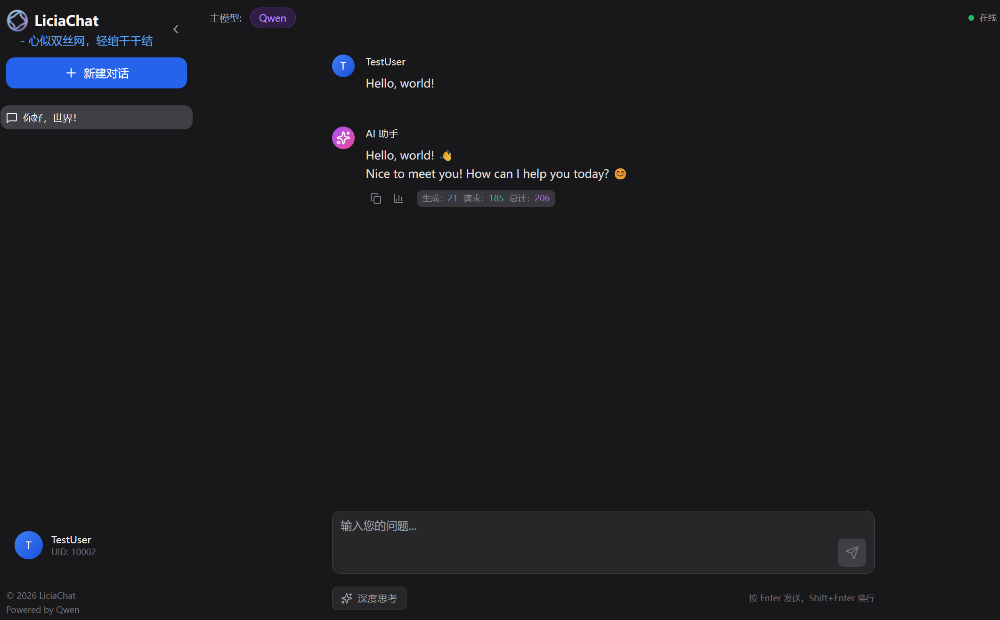

# LiciaChat - 追问

> **"天不老，问难灭。心似双丝网，轻绾千千结"**
> *"Heaven ages not, memory breaks not—A mind like twin threads, gently gathering thousands asks."*

*"Built by a lawyer who got tired of expensive API bills and heavy deployments.（由一位受够了昂贵 API 账单和沉重部署的律师构建。"*

一个支持小规模多用户、多对话持久化、长对话的轻量级 LLM Chat 应用。



> ⚠️ **注意**: 业余玩家 + AI 辅助开发。功能迭代中，破坏式更新频繁。

## ✨ 功能特性

- 🔐 基础多用户系统
- 💬 多对话持久化，支持自定义对话标题和创建、删除对话
- 🧠 对话内记忆，上下文滚动摘要技术支撑长对话，降低 Token 消耗，暂无跨对话记忆、长期记忆系统
- ⚡ 流式响应，支持深度思考内容折叠展示，Token 消耗展示
- 📝 Markdown 渲染（代码高亮、数学公式、表格）
- 🎨 响应式设计、深色主题、流畅动画
- 🔑 BYOK 模式（用户自带 API Key），用户使用邀请码注册
- 📧 对接阿里云百炼平台 API

## 📦 快速部署

### 环境要求
- Python 3.11+，推荐使用Python 3.14+
- Node.js 18+
- 阿里云百炼 API Key（或兼容 OpenAI Chat Completion 的 LLM API）

### 1. 克隆项目

```bash
git clone git clone https://github.com/TannisCon/LiciaChat.git
cd LiciaChat
```

### 2. 后端部署

```bash
# 创建虚拟环境
python -m venv .venv
.venv\Scripts\activate  # Windows
source .venv/bin/activate  # Linux/Mac

# 安装依赖
pip install -r requirements.txt

# 复制并编辑配置文件
cp config.yaml.example config.yaml
cp .env.example .env

# 启动服务
python main.py
```

后端运行在 `http://localhost:8000`

**初始管理员账户：**
- 邮箱：`config.yaml` 中配置的 `admin_email`
- 密码：`password`

⚠️ **首次启动后请立即修改默认密码！**

### 3. 前端部署

```bash
cd frontend
npm install
npm run dev
```

前端运行在 `http://localhost:5173`

### 4. 构建前端

```bash
cd frontend && npm run build
```

构建输出到 `static/dist` 目录，可使用 Nginx 托管。

## 🚀 生产部署

生产部署请参考 [生产部署指南](docs/prod_deploy.md)。

## 🔒 安全建议

1. 修改 `config.yaml` 中的 `admin_email` 和 `jwt_secret`
2. 生产环境使用 HTTPS
3. 敏感配置使用环境变量
4. 定期备份 `database.db`
5. 妥善保管 `api_key_encryption_key`

## 📝 API 文档

启动后端后访问 `http://localhost:8000/docs` 查看完整 API 文档。

## 📄 许可证

MIT License

本项目包含 Apache 2.0 许可的依赖（如 TypeScript、OpenAI SDK 等），其许可证和版权声明已保留在源代码中。

## 📖 更多文档

- [项目技术文档](docs/project_description.md)
- [生产部署指南](docs/prod_deploy.md)
- [数据库结构](docs/database_structure.md)

## 🙏 致谢

- [FastAPI](https://fastapi.tiangolo.com/)
- [React](https://react.dev/)
- [OpenAI Python SDK](https://github.com/openai/openai-python)